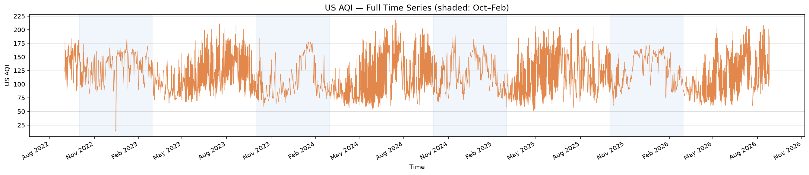
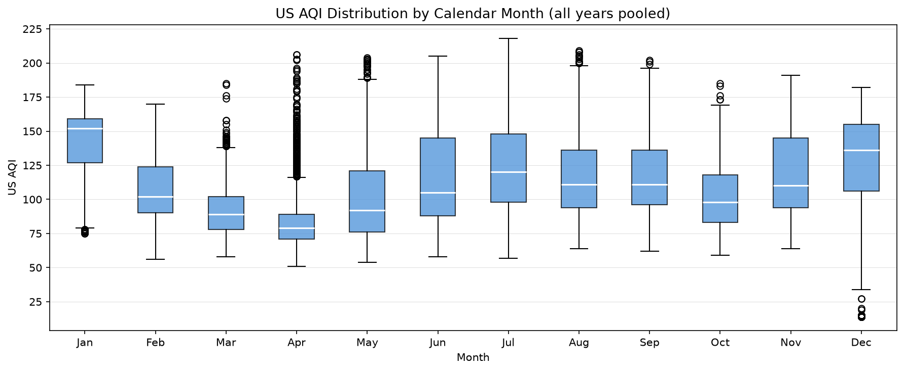
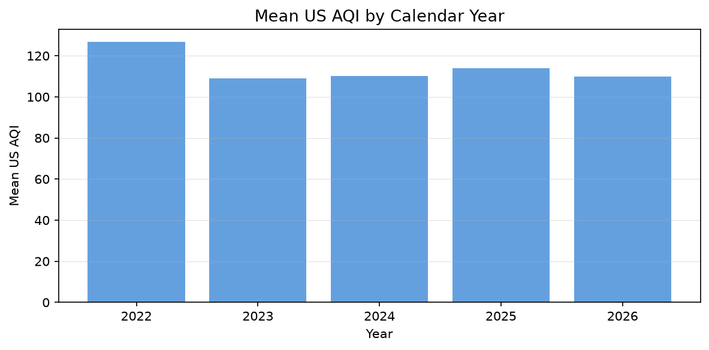
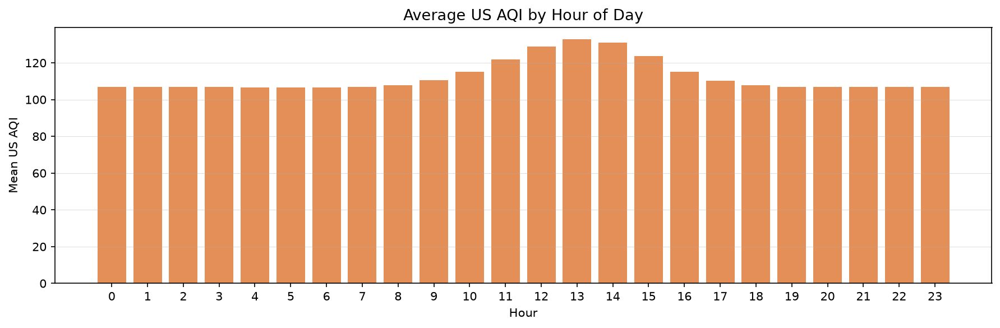
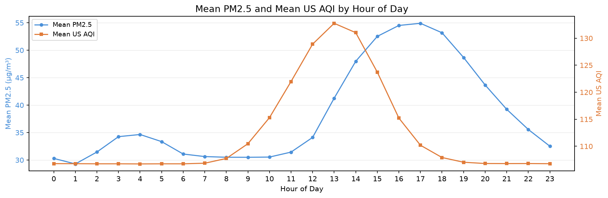
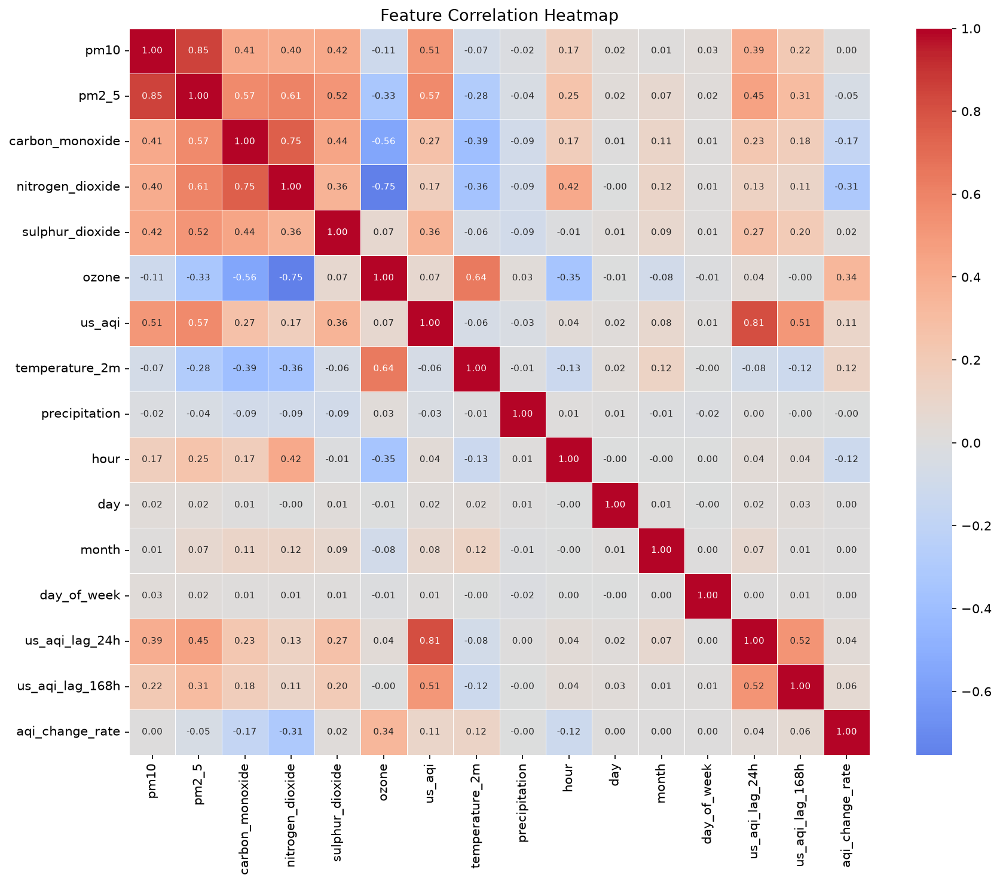

# Pearls AQI Predictor — Project Report

**Project:** Islamabad Air Quality Index (AQI) 3-Day Forecast  
**Candidate:** Amad Ahmad  
**Organisation:** 10 Pearls  
**Data source:** Open-Meteo (open-source, no API key required)  
**Stack:** Open-Meteo → Hopsworks → GitHub Actions → FastAPI / Render → Streamlit Cloud

---

## 1. Problem Statement

Air quality in Islamabad fluctuates significantly across seasons and hours. A 3-day AQI forecast gives residents and health-conscious consumers actionable advance notice — long enough to plan outdoor activity, short enough to be useful.

The target metric is **US AQI**, the index most people encounter on weather apps. The forecast is expressed as a **rolling 24-hour average per day** (next 24 h, 24–48 h, 48–72 h), which smooths out hourly noise and is more meaningful than a single hourly point estimate.

---

## 2. Data

### Source

All data comes from [Open-Meteo](https://open-meteo.com), a free, open-source weather and air quality API with no rate limits and no API key. Two endpoints are used:

- **Air Quality API** — `pm10`, `pm2_5`, `carbon_monoxide`, `nitrogen_dioxide`, `sulphur_dioxide`, `ozone`, `us_aqi`
- **Archive Weather API** — `temperature_2m`, `precipitation`

The dataset covers **Islamabad (33.68°N, 73.04°E)** from **September 2022 to September 2026** — the full available history for this location at the time of training, yielding **35,208 hourly rows** with no missing hours.

### EDA Highlights

**AQI time series (full history)**

Clear seasonal pattern: AQI deteriorates sharply in winter months (Oct–Jan) and recovers through spring. Summer shows moderate AQI with occasional spikes.

---

**Monthly distribution**

December and January show the highest median AQI and widest spread. March through August are consistently lower. This seasonal signal is what the model captures through calendar features.

---

**Year-over-year trend**

No significant trend across years — the problem is stationary enough that a model trained on 2022–2025 generalises to 2026.

---

**Hourly pattern**

AQI peaks in the work time (9-5). This pattern makes `hour` a meaningful feature.

---

**PM2.5 vs AQI by hour**

PM2.5 is the dominant driver of US AQI in Islamabad. The relationship is approximately linear across most of the range, with some non-linearity at high values. This supports tree-based models over linear ones for the higher AQI range.

---

**Correlation heatmap**

`us_aqi` correlates strongly with `pm2_5` (0.57), and also with `pm10`. Weather features (`temperature_2m`, `precipitation`) show modest but real correlation. Lag features were added to capture autocorrelation not visible in this static heatmap.Lag 24 hr is the correlates the strongest with the us-aqi (0.81). 

---

## 3. Feature Engineering

| Feature | Derivation | Rationale |
|---------|-----------|-----------|
| `us_aqi_lag_24h` | `us_aqi` shifted 24 h | Yesterday's AQI at the same hour is the single strongest predictor |
| `us_aqi_lag_168h` | `us_aqi` shifted 168 h | Same hour, same day last week — captures weekly seasonality |
| `aqi_change_rate` | `us_aqi.diff()` where time delta = 1 h | Momentum — a rising AQI is more likely to keep rising |
| `hour`, `day`, `month`, `day_of_week` | Parsed from timestamp | Encode the intraday and seasonal patterns observed in EDA |
| `temperature_2m`, `precipitation` | Directly from Open-Meteo weather API | Weather is a causal driver of dispersion |
| `pm10`, `pm2_5`, `carbon_monoxide`, `nitrogen_dioxide`, `sulphur_dioxide`, `ozone` | Directly from Open-Meteo AQ API | Pollutant levels at prediction time |

**Why these lags specifically:** 24 h captures the daily autocorrelation clearly visible in the timeseries. 168 h (7 days) captures the weekly pattern visible in the day-of-week chart. Longer lags were tested but added minimal signal given that Open-Meteo history isn't always complete beyond a week for the forecast endpoints.

---

## 4. Target Definition

Three targets, each a **forward-looking 24-hour rolling average of `us_aqi`**:

| Target | Period |
|--------|--------|
| `avg_aqi_next_24h` | Hours h+1 to h+24 |
| `avg_aqi_24_48h` | Hours h+25 to h+48 |
| `avg_aqi_48_72h` | Hours h+49 to h+72 |

Rolling average rather than a single point forecast because:
- Daily planning decisions (outdoor activity, school pickup) are not made on a single hour
- Averaging smooths measurement noise without losing predictive structure
- It matches how weather apps communicate air quality to consumers

---

## 5. Model Selection

Three model families were trained per target and compared on a **chronological holdout** (no shuffle — last 30 days of the dataset used as test):

| | Rationale |
|--|----------|
| **RandomForest** | Strong baseline for tabular data, handles non-linearity, resistant to noise |
| **Ridge** | Linear baseline — shows how much of the signal is linear vs non-linear |
| **XGBoost** | Gradient boosting with built-in regularisation, typically best on tabular lag problems |

Memory constraints (8 GB RAM) shaped hyperparameters: `n_estimators=100` for RandomForest, `n_estimators=200` for XGBoost, `n_jobs=2` to cap parallel thread use.

### Results — Test Set (last 30 days, 698 rows) as an example

| Target | Model | RMSE | MAE | R² |
|--------|-------|------|-----|----|
| avg_aqi_next_24h | RandomForest | 11.77 | 9.48 | 0.172 |
| avg_aqi_next_24h | Ridge | 14.04 | 11.53 | -0.177 |
| **avg_aqi_next_24h** | **XGBoost** | **10.86** | **8.76** | **0.296** |
| avg_aqi_next_24h | Persistence baseline | 24.02 | 18.59 | -2.444 |
| avg_aqi_24_48h | RandomForest | 17.89 | 14.55 | -0.888 |
| avg_aqi_24_48h | Ridge | 18.01 | 14.55 | -0.916 |
| **avg_aqi_24_48h** | **XGBoost** | **16.20** | **13.40** | **-0.549** |
| avg_aqi_24_48h | Persistence baseline | 28.75 | 22.97 | -3.879 |
| avg_aqi_48_72h | RandomForest | 17.69 | 14.63 | -0.773 |
| avg_aqi_48_72h | Ridge | 18.86 | 15.09 | -1.014 |
| **avg_aqi_48_72h** | **XGBoost** | **17.16** | **14.14** | **-0.668** |
| avg_aqi_48_72h | Persistence baseline | 30.14 | 24.09 | -4.147 |

XGBoost won on all three targets. Sometimes the average aqi for day 1 also have R² values in 0.5 ranges suggesting this strategy is best for the next day instead of further days.

### Interpreting Negative R²

R² for days 2 and 3 is negative. This does **not** mean the model is worse than random — it means it has higher variance than predicting the training mean. The correct comparison for a forecasting problem is the **persistence baseline** (predict that tomorrow's AQI equals today's). Against that benchmark, all three models win by a large margin:

| | Model RMSE | Persistence RMSE | Improvement |
|--|-----------|-----------------|-------------|
| Day 1 | 10.86 | 24.02 | **55% lower error** |
| Day 2 | 16.20 | 28.75 | **44% lower error** |
| Day 3 | 17.16 | 30.14 | **43% lower error** |

Negative R² at days 2–3 reflects the inherent unpredictability of AQI three days out, not a model failure. The persistence baseline also has strongly negative R² (-3.9 at day 3), which confirms the signal exists — it's just harder to capture at longer horizons.

The code enforces a hard assertion: every model must beat the persistence RMSE before being pushed to the registry. This fails loudly on future retraining runs if a model ever regresses below baseline.

---

## 6. Architecture Decisions

### Why Hopsworks Serverless

Hopsworks provides a managed feature store and model registry with a free tier sufficient for this project. Separating feature engineering from training and serving means:
- The training pipeline reads a consistent, versioned feature table
- The serving layer pulls models from a registry with versioning — not from ad-hoc file paths
- Feature pipelines can be improved independently of the models

### Why Open-Meteo for serving (not the feature store)

At serving time, the backend needs only the single latest hour's feature vector. Reading from the feature store requires loading the full 35k-row group. Open-Meteo returns the last 200 hours in ~1 second and the features are computed in-memory. This keeps backend startup under 30 seconds.

### Why fallback models in the repo

Render's filesystem is ephemeral — files don't survive redeploys. The Hopsworks registry is always the primary source, but if the registry is unreachable during a cold start, the backend falls back to `data/fallback_models/` (committed to the repo by the daily training workflow). This avoids a hard dependency on Hopsworks being reachable at every Render restart.

### Why GitHub Actions for scheduling

No dedicated server, no cost, integrates directly with the repo. The hourly pipeline runs on GitHub's cloud runners which have unrestricted outbound network access — which matters because Kafka (Hopsworks' write transport) is blocked on some consumer ISP connections.

---

## 7. Monitoring

- **Persistence assertion:** `train.py` hard-asserts every model beats the persistence baseline before pushing. If a future retraining run produces a worse model, the pipeline fails loudly rather than silently serving degraded predictions.
- **Dashboard metrics panel:** RMSE, MAE, and R² from the last training run are embedded in the `/predict` response and displayed in the dashboard's "Model Performance" expander, giving a mentor or user a direct signal of expected prediction error.
- **±RMSE on forecast cards:** each day's forecast card shows the model's test-set RMSE as a ± range, communicating uncertainty to the consumer without statistical jargon.

---

## 8. What Would Come Next

- **Hourly short-range model (next 3–7 h):** A compressed single-output model per hour, pushed only if under a size threshold. The infrastructure is in place; removed from Phase 1 due to the 1.1 GB size of the prototype.
- **More cities:** `constants.py` already has a `CITIES` dict. The feature pipeline and training pipeline would need a `--city` argument and separate feature group / model names per city.
- **Explainable predictions:** SHAP values per prediction to show which features drove a high-AQI forecast — useful for the dashboard's "what's causing this" question.
- **Drift detection:** compare the rolling average of recent `us_aqi` predictions against actuals once the feature store has fresh data; alert if MAE exceeds a threshold.
